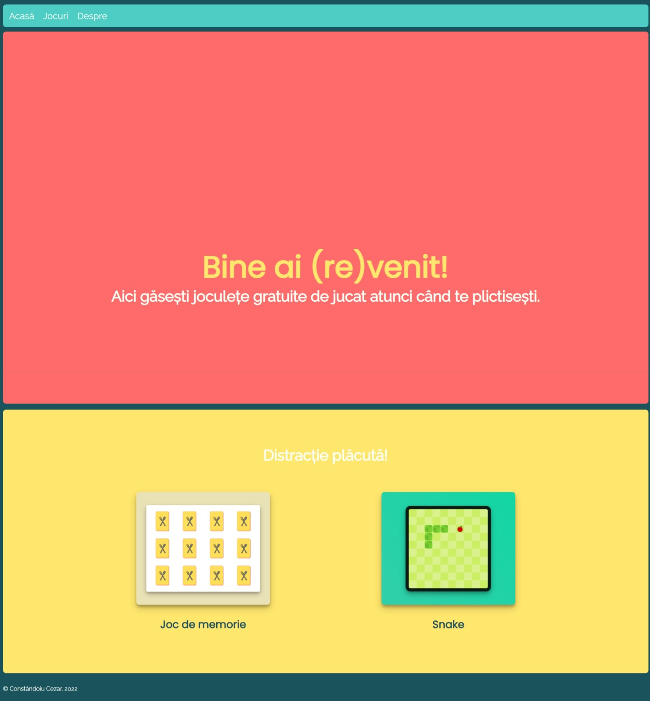
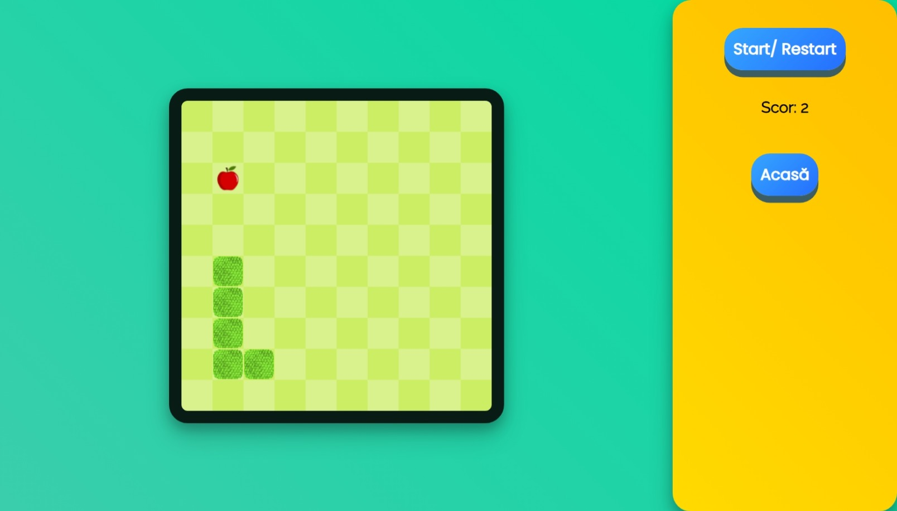
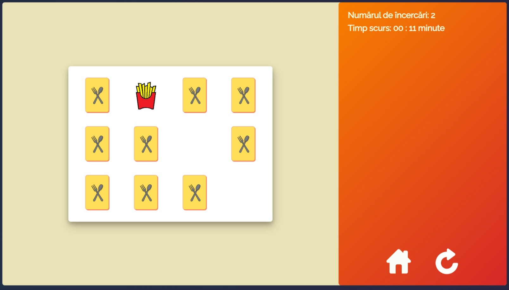

# Snake and Memory Cards Games Project

This project contains two classic games implemented using HTML, CSS, and JavaScript: Snake and Memory Cards Game. Both games offer simple yet engaging gameplay experiences, perfect for beginners and enthusiasts alike.



## Table of Contents

- [Introduction](#introduction)
- [Features](#features)
- [How to Play](#how-to-play)
- [Installation](#installation)
- [Credits](#credits)

## Introduction

This project was created as a learning exercise to practice HTML, CSS, and JavaScript. It includes two popular games, Snake and Memory Cards Game, which offer enjoyable gameplay experiences and opportunities for skill development.

## Features

### Snake Game
- Snake movement controlled by arrow keys or keyboard shortcuts
- Randomly generated apples for the snake to eat
- Score tracking and display
- Game over detection upon collision with walls or the snake's own body
- Pause functionality



### Memory Cards Game
- Classic memory cards matching gameplay
- Customizable grid size and number of card pairs
- Timer tracking gameplay duration
- Score tracking based on moves made



## How to Play

### Snake Game
1. Use the arrow keys or keyboard shortcuts (WASD) to control the snake's movement.
2. Guide the snake to eat apples without colliding with walls or its own body.
3. Each apple eaten increases the snake's length and score.
4. The game ends when the snake collides with a wall or itself.
5. Press 'P' to pause the game.

### Memory Cards Game
1. Click on cards to reveal their images.
2. Match pairs of identical images to clear them from the board.
3. The game ends when all pairs are matched.
4. Try to complete the game in the fewest moves and shortest time possible.

## Installation

To run the games locally, follow these steps:

1. Clone the repository:

```bash
git clone https://github.com/ccaesar26/browser-games-html-css-js.git
```

2. Navigate to the project directory:

```bash
cd browser-games-html-css-js
```

3. Open the index.html file in your web browser.

## Credits

This project was created by [Your Name]. Special thanks to the following resources:

- [Learn to Code — For Free — Coding Courses for Busy People (freecodecamp.org)](https://www.freecodecamp.org/)
- [Learn JavaScript by Building 7 Games - Full Course - YouTube](https://www.youtube.com/watch?v=lhNdUVh3qCc&list=PL9lgRfEVmQdfPgUL5ld-U0kx2zEBR92TA&index=16)
