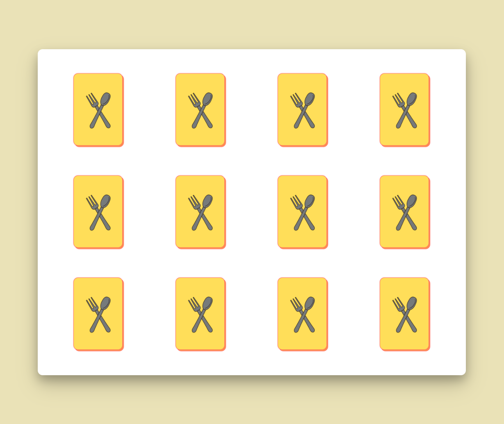
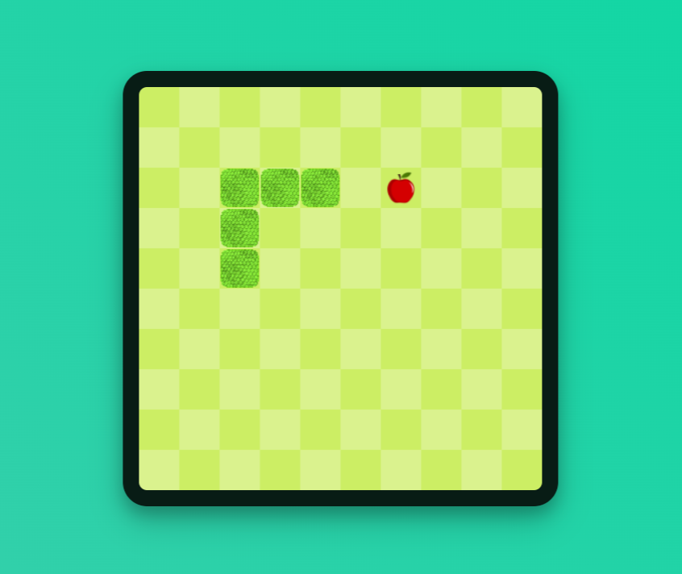

# browser-games-html-css-js
Jocuri în browser - LUCRARE PENTRU SUSȚINEREA EXAMENULUI DE ATESTARE PROFESIONALĂ - Constăndoiu Cezar
COLEGIUL NAȚIONAL „GRIGORE MOISIL” ONEȘTI
SESIUNEA MAI 2022
Jocuri în browser
Joc de memorie – Găsește perechea & Snake
LUCRARE
PENTRU SUSȚINEREA EXAMENULUI DE ATESTARE PROFESIONALĂ
LA INFORMATICĂ
Elev: Profesor îndrumător:
Constăndoiu Cezar Melinte Elena-Carmen
2
Cuprins
Cuprins .....................................................................................................................................2
Argument .................................................................................................................................3
Prezentarea generală a interfeței site-ului ...............................................................................4
1. Pagina principală ..............................................................................................................4
2. Jocul de memorie .............................................................................................................5
3. Jocul „Snake” ....................................................................................................................6
Prezentarea funcționalității site-ului .......................................................................................7
1. Pagina principală ..............................................................................................................7
2. Jocul de memorie .......................................................................................................... 10
Structura paginii. HTML ................................................................................................ 10
Elemente de design. CSS ................................................................................................ 10
Funcționalitatea jocului. JavaScript .............................................................................. 11
3. Jocul „Snake” ................................................................................................................. 15
Structura paginii. HTML ................................................................................................ 15
Elemente de design. CSS ................................................................................................ 15
Funcționalitatea jocului. JavaScript .............................................................................. 17
Resurse .................................................................................................................................. 22
3
Argument
În zilele de astăzi, oamenii tind să fie din ce în ce mai ocupați, uitând, parcă, să se mai relaxeze. În acest sens, am ales să dezvolt două jocuri care, nu numai că relaxează prin simplitatea lor, ci și antrenează mintea. Primul joc, numit „Joc de memorie”, constă în 6 perechi de câte două cărți așezate cu fața în jos pe tablă ce trebuie întoarse două câte două până la găsirea tuturor perechilor. Al doilea joc este unul clasic pe care toți îl cunoaștem atât de bine, și anume: „Snake” – un șarpe ca se deplasează pe tablă, mâncând mere ce-i măresc lungimea până când acesta se lovește.
Pentru dezvoltarea acestor două jocuri, am considerat ca fiind cel mai facil limbajul HTML, bineînțeles, însoțit de CSS și JavaScript. Dezvoltarea proiectului nu a necesitat un software solicitant, ci doar un browser și un editor. Personal, am ales Microsoft Edge, respectiv Microsoft Studio Code.
4
Prezentarea generală a interfeței site-ului
1. Pagina principală
Meniu cu linkuri către fiecare secțiune a paginii.
Secțiunea „Acasă”, unde utilizatorul este întâmpinat cu un mesaj de bun venit.
Secțiunea „Jocuri”, unde utilizatorul selectează jocul dorit.
Secțiunea „Despre” unde se pot găsi detalii de contact.
5
2. Jocul de memorie
• Înainte de începerea jocului:
• Pe parcursul jocului:
• La finalizarea jocului:
Începerea jocului
Accesarea paginii principale
Reînceperea jocului
Reînceperea jocului
Numărul de încercări și durata jocului
6
3. Jocul „Snake”
• Înainte de începerea jocului:
• Pe parcursul jocului:
• La punerea pe pauză a jocului:
• La finalizarea jocului:
Începerea/ Reînceperea jocului
Accesarea paginii principale
Afișarea scorului
Punerea pe pauză (la apăsarea tastei „P”)
7
Prezentarea funcționalității site-ului
1. Pagina principală
Pagina principală „index.html” este alcătuită din tagul <html> și conținutul său, structurat în alte două taguri, <head> și <body>.
Conținutul <body>-ului este organizat în trei secțiuni, la care se adaugă o bară de navigare cu linkuri aferente fiecărei secțiuni:
• Pentru bara de navigare am utilizat tagul <nav>;
• Pentru secțiunea de titlu am utilizat tagul <header>;
• Pentru secțiunea cu jocuri am utilizat tagul <content>;
• Pentru secțiunea de contact am utilizat tagul <footer>.
Pagina #page este asemenea unui tabel cu o coloană și patru rânduri, aspect conferit de proprietatea „display: grid;”. Proprietățile specifice „grid-template-rows” și „grid-template- columns” reflectă atât dimensiunea rândurilor, respectiv a coloanelor, cât și numărul acestora (prin numărul de mărimi atribuite).
Bara de navigare #navbar constă într-o listă neordonată cu trei elemente – linkurile către secțiunile aferente. Aceste trimiteri se realizează cu ajutorul atributului href căruia i se atribuie id-ul secțiunii corespunzătoare.
Pentru a rămâne mereu ancorată în zona de sus a ferestrei, am utilizat atributul position: sticky;, iar pentru a se afișa deasupra tuturor celorlalte elemente am utilizat atributul z-index: 1;. De asemenea, pentru stilizarea barei de navigare la mutarea cursorului deasupra unui link am folosit selectorul „:hover” postpus celui al clasei elementului
<nav id="navbar"> <ul id="nav-list"> <li> <a class="nav-link" href="#title_section"> Acasă </a> </li> <li> <a class="nav-link" href="#content"> Jocuri </a> </li> <li> <a class="nav-link" href="#contact"> Despre </a> </li> </ul> </nav>
#page { display: grid; grid-template-columns: 100%; grid-template-rows: 60px 100vh auto auto; grid-gap: 16px; background-color: #1A535C; }
8
respectiv: „.nav-link:hover”. În aceeași manieră, am procedat și pentru momentul în care linkul este apăsat: „.nav-link:active”. În plus, pentru colorarea graduală a linkurilor am creat o animație adecvată pe care am atribuit-o, mai apoi, selectorului „.nav-link:hover”.
O animație se declară ca o regulă de tip @keyframes cu un nume, atribuind celor mai importante momente anumite proprietăți.
În cazul de față, la 100%, adică la finalizarea animației, proprietatea background-color primește culoarea #FF6B6B.
Cu numele acesteia se atribuie, mai apoi, elementului dorit prin intermediul proprietăților specifice: animation-name, animation-duration, animation-fill-mode, ce semnifică: numele, durata, respectiv comportamentul animației la finalizarea ei (în cazul de față, elementul își păstrează atributele animației și după finalizarea ei).
Fiecare secțiune constă în câte un tag sugestiv: <header>, <content>, respectiv <footer>. Aceste taguri nu sunt nimic altceva decât 
-uri care au fost introduse în HTML5 pentru a veni în ajutorul dezvoltatorilor ce doresc să exprime rolul lor.
Din punct de vedere al stilului realizat cu ajutorul CSS, sunt anumite aspecte ce consider că merită a fi menționate.
<header id="title_section"> <h1 class="title">Bine ai (re)venit!</h1> <h2 class="subtitle">Aici găsești joculețe gratuite de jucat atunci când te plictisești.</h2> </header> <content id="content"> <article id="intro"> <h2 class="subtitle">Distracție plăcută!</h2> </article> <article id="games"> <a href="games/memory-game/index.html" class="game_link"> 
  <h3 class="game_title">Joc de memorie</h3> 
 </a> <a href="games/snake/index.html" class="game_link"> 
  <h3 class="game_title">Snake</h3> 
 </a> </article> </content> <footer id="contact"> 
&copy; Constăndoiu Cezar, 2022
 </footer>
@keyframes hoverLink { 100% { background-color: #FF6B6B; } } .nav-link:hover { animation-name: hoverLink; animation-duration: 500ms; animation-fill-mode: forwards; }
9
Spre exemplu, se poate observa că la accesarea linkurilor din bara de navigare, derularea se face lin, ca o animație. De această „animație” este responsabilă proprietatea scroll-behavior: smooth;.
Alt aspect notabil îl reprezintă reorganizarea paginii la redimensionarea ferestrei. Acest lucru se realizează cu un media query, @media, căruia i s-a impus condiția max-width: 860px. Astfel, când lățimea ferestrei este de cel mult 860 de pixeli, elementului #games i se atribuie alte proprietăți: în loc ca imaginile jocurilor să fie afișate una lângă cealaltă, acestea se vor afișa una dedesubtul celeilalte.
html { scroll-behavior: smooth; }
@media (max-width: 860px) { #games { flex-direction: column; align-items: center; } }
10
2. Jocul de memorie
Structura paginii. HTML
Pagina propriu-zisă (<body>) este alcătuită din trei blocuri (
): unul pentru zona de joc, una pentru zona cu scorul și timpul, respectiv una pentru caseta pop-up (ce se afișează la începerea și finalizarea jocului).
Elemente de design. CSS Pagina este asemenea unei grile cu un rând și două coloane. Dimensiunile acestora au fost declarate cu ajutorul proprietății „grid-template-columns” ce reprezintă atât numărul, cât și lățimea lor. Mărimile exprimate în „fr” reprezintă fracțiuni, astfel că atribuirea din dreapta atribuie primei coloane lățimea de două treimi din lățimea totală a paginii, respectiv o treime celei de-a doua coloane. Prin intermediul
<body> 
 
 

 
 
 <section id="sideSection"> 
 <h3>Numărul de încercări: 0</h3> <h3>Timp scurs: 00 : 00 minute</h3> 
 
 

 <a href="../../index.html">

</a> 
 </section> 
 
 
 
Apasă butonul pentru a începe...
 

 

 
 </body>
Zonă de joc
Zonă pentru scor și timp
Meniul de început/ final
#game { display: grid; grid-template-columns: 2fr 1fr; justify-items: center; align-items: center; height: 97.5vh; background-color: #eae2b7; border-radius: 8px; }
Aici vor fi inserate, mai târziu, cărțile de joc sub formă de 
-uri.
11
atributelor „justify-items” și „align-items” am putut centra elementele din interiorul containerului (
-ului) atât pe verticală, cât și pe orizontală.
De asemenea, tabla de joc este tot ca o grilă, de această dată, de tip flexbox. Cele 12 cărți de joc, care ar fi trebuit, în mod normal, să fie afișate într-o singură linie, sunt acum afișate câte 4 pe linie, formând astfel un tabel de 3×4.
Dacă o carte de joc are lățimea de 150 de pixeli la care se adaugă padding (spațiu de jur împrejurul elementului) de 16 pixeli (8 la stânga și 8 la dreapta), atunci patru cărți de joc alăturate ocupă în lățime 664 de pixeli. Schema de mai jos explică de ce am ales acest număr ca lățime pentru tabla de joc. La fel se procedează și pentru stabilirea înălțimii tablei.
Funcționalitatea jocului. JavaScript
Cărțile de joc dintr-un vector sunt reordonate aleatoriu și inserate pe tabla de joc. La click pe o carte, aceasta este întoarsă, iar la click pe o a doua carte, aceasta este întoarsă și comparată cu cea de dinainte. Dacă sunt la fel, sunt luate de pe tablă; în caz contrar, sunt întoarse din nou. Jocul se termină atunci când se găsesc toate perechile.
Cărțile de joc sunt stocate într-un vector declarat de tipul const cu elemente de tip struct, fiecare carte având un nume și o imagine corespunzătoare.
Cărțile sunt amestecate de fiecare dată înainte de începerea jocului. Acest lucru a fost făcut posibil cu ajutorul funcției predefinite sort(), ce acționează în felul următor:
Fără parametri, funcția sort() ordonează un vector crescător. În schimb, dacă are ca parametru o funcție de comparare, atunci își modifică comportamentul în funcție de valoarea returnată de funcția-parametru, astfel:
Valoare pe care o returnează funcția-parametru
Ordinea sortării
> 0
Plasează al doilea element înaintea primului.
< 0
Plasează primul element înaintea celui de-al doilea.
= 0
Se menține ordinea inițială.
8px+ 150px +8px+ 150px + 8px + 150px +8px+ 150px +8px = 664px
cardArray.sort(() => 0.5 - Math.random());
Returnează un număr real din intervalul (0,1).
Funcție ce returnează un număr din intervalul (-0,5; 0,5).
Întrucât oricare două cărți sunt sortate după criterii diferite, vectorul cu cărțile de joc este sortat într-o ordine aleatorie.
.grid { display: flex; flex-wrap: wrap; height: 498px; width: 664px; }
.playcard { width: 150px; height: 150px; padding: 8px; border-radius: 8px; }
12
După amestecarea cărților de joc urmează declararea și inițializarea unor variabile:
• const resultDisplay = document.querySelector('#result'); – memorează în variabila grid elementul din pagina html ce are clasa „.grid”;
• const resultDisplay = document.querySelector('#result'); – memorează în variabila resultDisplay elementul din pagina html ce are id-ul „#result”;
• let score = 0; – variabilă pentru numărul de încercări;
• let cardsChosen = []; let cardsChosenId =[]; let cardsWon = []; – sunt declarați și inițializați cu câte un șir vid, trei vectori în care se va memora, mai apoi, cărțile întoarse pe tablă (maxim două în același timp), id-urile acestor cărți, respectiv cărțile a căror pereche au fost găsite, deci care nu mai sunt pe tablă.
De crearea tablei de joc este responsabilă funcția createBoard(), ce este apelată la încărcarea paginii.
Pentru fiecare carte de joc cu id-ul de la 0 la 12 exclusiv (în joc sunt 12 cărți în total, adică 6 perechi) sunt realizate următoarele operații:
→ este declarată variabila card, fiind creat în un element img (imagine);
→ elementul imagine are ca sursă imaginea „blank.png” (spatele cărții);
→ elementul imagine primește data-id-ul egal cu variabila i (poziția cărții pe tablă);
→ elementului imagine îi este atribuită funcția flipCard ce se declanșează la click pe el;
→ elementul imagine img (variabila card) este pus la propriu în pagină în grid (adică 
-ul cu clasa „.grid”);
→ elementul card primește două clase („.playcard”, respectiv „.playcard_anim”) ce sunt utilizate pentru stil în CSS.
Chiar dacă nu este vizibil dezvoltatorului, în cod există acum elemente de tipul:

Urmează, mai apoi, funcția flipCard() ce se ocupă cu întoarcerea cărților la click pe ele.
În variabila cardId este stocat id-ul cărții pe care am dat click. Cu ajutorul id-ului și al metodei push, am inserat la sfârșitul vectorului cardsChosen numele cărții și la sfârșitul vectorului cardsChosenId, id-ul cărții respective.
Apoi, cardul primește ca sursă imaginea corespunzătoare feței cu ilustrația sa, ce este salvată în vectorul cardArray pe poziția egală cu id-ul la câmpul img. De asemenea, elementului img aferent cărții îi este eliminată clasa „.playcard_anim” pentru a nu mai putea fi întoarsă de către jucător.
Nu în cele din urmă, dacă vectorul cardsChosen are două elemente (adică dacă sunt întoarse două cărți pe tablă), atunci, cu ajutorul funcției predefinite setTimeout, este apelată funcția checkForMatch cu o întârziere de 500ms (0,5 secunde).
function createBoard() { for(let i=0; i<cardArray.length; i++) { const card = document.createElement('img'); card.setAttribute('src','images/blank.png'); card.setAttribute('data-id', i); card.addEventListener('click', flipCard); grid.appendChild(card); card.setAttribute('class', "playcard playcard_anim"); } }
function flipCard() { let cardId = this.getAttribute('data-id'); cardsChosen.push(cardArray[cardId].name); cardsChosenId.push(cardId); this.setAttribute('src', cardArray[cardId].img); this.classList.remove("playcard_anim"); if(cardsChosen.length === 2) { setTimeout(checkForMatch, 500); } }
13
Mai apoi, urmează funcția checkForMatch() unde sunt verificate cele două cărți întoarse.
În constanta cards sunt salvate toate elementele din pagină de tipul imagine, în acest caz, cărțile de joc. Întrucât sunt mai multe elemente, constanta cards va fi, practic, un vector de imagini. În constantele optionOneId și optionTwoId sunt stocate id-urile cărților ce sunt întoarse.
Cu ajutorul variabilelor ce stochează id-urile cărților supuse comparației, am verificat dacă utilizatorul a apăsat același card de două ori. În acest caz, cărțile se întorc cu fața în jos, iar jucătorul este alertat despre greșeala comisă. De asemenea, cartea va putea fi din nou întoarsă, deci primește din nou clasa „.playcard_anim”.
Apoi se verifică dacă cele două cărți sunt de același fel. Operatorul „===” verifică atât egalitatea valorilor variabilelor, cât și a tipului de date. Astfel, aici sunt comparate câmpurile „name” ale fiecărei cărți întoarse. În caz de egalitate, tabla este eliberată (în locul cărților este plasată câte o imagine de culoarea tablei, creând efectul de luare a cărții), iar fiecare zonă în care au fost cardurile nu mai poate fi apăsată (la click nu va mai fi apelată funcția flipCard). Perechile găsite sunt adăugate în vectorul cardsWon și variabila score (ce reprezintă numărul de încercări) crește cu o unitate.
Însă, dacă cele două cărți întoarse nu corespund, atunci sunt întoarse înapoi cu fața în jos (le sunt atribuite imagini cu spatele unei cărți de joc) și le este redată capacitatea de a fi din nou apăsate pentru întoarcere (le este adăugat evenimentul la click reprezentat de funcția flipCard). De asemenea, crește numărul de încercări, salvat în variabila score cu o unitate.
După verificările efectuate, cei doi vectori pentru cărțile comparate sunt goliți (li se atribuie câte un vector vid), iar apoi este actualizat numărul de încercări. În cele din urmă, dacă lungimea vectorului ce conține perechile găsite este egal cu jumătate din cea a vectorului cu cărțile de joc, acest fapt înseamnă că jocul s-a terminat. Trebuie ținut cont că în vectorul cardArray sunt perechile, deci fiecare carte este de două ori. Astfel, dacă jucătorul a găsit toate perechile, cronometrul se oprește (nu mai acționează funcția timer() la intervalul de
function checkForMatch() { const cards = document.querySelectorAll('img'); const optionOneId = cardsChosenId[0]; const optionTwoId = cardsChosenId[1];
if(optionOneId == optionTwoId) { cards[optionOneId].setAttribute('src', 'images/blank.png'); cards[optionTwoId].setAttribute('src', 'images/blank.png'); alert('Ai apăsat pe aceeași carte!'); cards[optionOneId].classList.add("playcard_anim"); } else if(cardsChosen[0] === cardsChosen[1]) { cards[optionOneId].setAttribute('src','images/white.png'); cards[optionTwoId].setAttribute('src','images/white.png'); cards[optionOneId].removeEventListener('click', flipCard); cards[optionTwoId].removeEventListener('click', flipCard); cardsWon.push(cardsChosen); score++; } else { cards[optionOneId].setAttribute('src','images/blank.png'); cards[optionTwoId].setAttribute('src','images/blank.png'); cards[optionOneId].classList.add("playcard_anim"); cards[optionTwoId].classList.add("playcard_anim"); score++; }
cardsChosen = []; cardsChosenId = []; resultDisplay.textContent = score;
if(cardsWon.length === cardArray.length/2) { clearInterval(timer1); let mesaj = "Felicitări! Ai finalizat jocul din " + score; //[...] document.querySelector("#sideSection").style.display = "none"; document.querySelector("#popUp").style.display = "flex"; document.querySelector("#finalMessage").textContent = mesaj; restartButton.classList.remove('hidden'); homeButton.classList.remove('hidden'); startButton.classList.add("hidden"); }
14
timp precizat; a se vedea explicațiile de mai jos) și este afișat mesajul corespunzător împreună cu numărul de încercări.
Mai sunt și alte elemente care nu țin neapărat de jocul propriu-zis, cum ar fi cronometrul, ce constă în două funcții, timer() și start().
Fie constanta timp, în care este stocat elementul  din pagină ce conține textul aferent cronometrului, și variabila t.
În funcția timer(), variabila t crește cu o unitate, după care este convertită într-un text formatat corespunzător (de exemplu, pentru t=141, time_convert(t) va fi „02 : 21”).
Mai apoi, sunt declarate constanta startButton, în care este memorat containerul aferent butonului de start, și variabila timer1.
La click pe butonul de start este asociată funcția start(), ce se ocupă cu începerea propriu-zisă a jocului: caseta cu mesajul de întâmpinare dispare, iar conținutul panoului lateral apare. De asemenea, cronometrul, adică variabila timer1, pornește: funcția timer este apelată la un interval de timp egal cu 1000ms (o secundă).
const timp = document.querySelector("#timp"); let t=0; function timer() { t++; timp.textContent = time_convert(t); }
const startButton = document.querySelector('#start'); let timer1; startButton.onclick = function start() { document.querySelector("#popUp").style.display = "none"; document.querySelector("#sideSection").style.display = "flex"; timer1 = setInterval(timer, 1000); }
15
3. Jocul „Snake”
Structura paginii. HTML
Pagina propriu-zisă (<body>) este alcătuită din trei blocuri (
): unul pentru zona de joc, una pentru zona cu scorul și timpul, respectiv una pentru caseta pop-up (ce se afișează la începerea și finalizarea jocului, dar și la punerea pe pauză).
Ca o observație, în interiorul containerului (
-ului) cu clasa „grid” se află alte 100 de 
-uri ce reprezintă pătratul în care se poate deplasa șarpele.
Tot în pagina HTML se regăsesc și câteva elemente de tip <audio> ce sunt responsabile cu sunetele la apăsarea tastelor, dar și la finalizarea jocului, adică lovirea șarpelui.
Elemente de design. CSS
Pagina este împărțită în două mari containere (
-uri): unul pentru joc, respectiv unul pentru controale (butonul „Start” și cel „Acasă”), această structură fiind realizată cu proprietatea display: grid;.
<body> 
 
 
 
 <!-- 10 x 10 grid = 100 div-uri --> 
 
 
 
 <button class="start">Start/ Restart</button> 
Scor: 0
 <a href="../../index.html"><button class="home"> Acasă </button></a> 
 
 

 </body>
Zonă de joc
Zonă pentru scor și butoane
Meniul de pauză/ final
<audio id="downSound"> <source src="audio/down.m4a" type="audio/mpeg"> </audio>
#game { display: grid; grid-template-columns: 3fr 1fr; justify-items: center; align-items: center; height: 100vh; }
16
De asemenea, fiecare parte este reîmpărțită la rândul ei, după cum se poate vedea și în schema de mai jos.
În containerul de clasă „.grid” există 100 de alte containere ce trebuie dispuse într-o plasare asemănătoare unui tabel de 10×10. În acest sens, fiecare 
 mic are dimensiunile de 40px pe 40px, iar containerul cadru este de dimensiuni de zece ori mai mari, respectiv 400px pe 400px.
Astfel, containerul cadru este afișat ca flexbox, display: flex;, cu componentele dispuse pe mai multe linii, în limita unei lățimi de 400 de pixeli (flex-wrap: wrap;). Aceste componente, adică 
-urile din interiorul 
-ului cu clasa „.grid” (selectate cu selectorul „.grid div” ce se referă la toate componentele de tipul 
 din interiorul elementului cu clasa „.grid”), au dimensiunile de 40 de pixeli lățime și 40 de pixeli lungime.
Meniul de pauză/ final constă într-un container cu id și clasă: 

. Prin intermediul clasei au fost atribuite proprietățile ce țin de afișare. Se pot observa atribute specifice proprietății display: flex;, însă asociate atributului display: none; care va fi modificat mai târziu. De asemenea, elementele din interiorul containerului sunt aliniate la centru atât pe verticală, cât și pe orizontală.
Prin intermediul id-ului „#message” au fost atribuite proprietățile ce țin de design. Astfel, poziția a fost setată ca absolută, adică o poziție ce nu depinde de celelalte elemente, și care, în combinație cu atributul z-index: 1;, permite afișarea unui element pe deasupra celorlalte.
Nu în cele din urmă, se mai remarcă mărul din joc, ce pare că se umflă și dezumflă. Acest lucru este datorat unei animații appleAnim, care micșorează imaginea.
id="game"
id="game-side"
id="side"
id="grid"
.grid { width: 400px; height: 400px; display: flex; flex-wrap: wrap; /*[...]*/ } .grid div { width: 40px; height: 40px; }
.message { display: none; flex-direction: column; align-items: center; justify-items: center; } #message { position: absolute; top: 15%; left: 10%; height: 50%; width: 45%; z-index: 1; /*[...]*/ }
@keyframes appleAnim { 50% {transform: scale(0.9);} 100% {transform: scale(1);} }
17
Funcționalitatea jocului. JavaScript
Jocul pornește la apăsarea butonului „Start”. Un șarpe de lungimea egală cu 3 începe să se deplaseze pe o direcție implicită (spre dreapta), care se modifică la apăsarea tastelor corespunzătoare. Deplasarea se face o dată la un interval de timp stabilit, dar variabil, până când șarpele se izbește fie de conturul câmpului, fie de propriul corp.
Deplasarea este simulată, întrucât la fiecare pas, doar capul (primul cerc) și coada (ultimul cerc) se modifică, restul corpului rămânând în aceeași poziție. Capul și coada se modifică, de fapt, prin adăugarea sau eliminarea clasei „.snake” ce presupune stabilirea unei imagini de fundal pentru containerul respectiv.
Scopul jocului este de a obține un scor cât mai mare, „mâncând” cât mai multe mere.
Ajungând la programul propriu-zis, se începe cu declararea variabilelor:
• const squares = document.querySelectorAll('.grid div'); – constanta squares este un vector ce salvează toate elementele de tip 
 din interiorul elementului de clasă „.grid”, cu alte cuvinte toate cele 100 de containere mici prin care se va deplasa șarpele;
• const scoreDisplay = document.querySelector('span'); – constanta scoreDisplay stochează elementul  în care se va afișa scorul;
• const startBtn = document.querySelector('.start'); – constanta startBtn stochează butonul „Start”;
• const messageDisplay = document.querySelector('.message'); – constanta messageDisplay stochează elementul de clasă „.message”, adică caseta de început;
• const width = 10; – constanta width salvează lățimea tablei, respectiv 10 pătrățele;
• let appleIndex = 0; – variabila appleIndex pentru indicele pătrățelului ce conține mărul;
• let currentSnake = [2,1,0]; – variabila currentSnake este un vector cu pozițiile pe care se află șarpele;
• let direction = 1; – variabila direction, ce poate avea următoarele valori:
o 1 – spre dreapta;
o 10 – în jos;
o -1 – spre stânga;
o -10 – în sus.
• let score = 0; – variabila score în care se salvează scorul;
• let speed = 0.95; – variabila speed ce reprezintă coeficientul cu care este înmulțit intervalul de timp dintre deplasări la mâncarea unui măr;
• let intervalTime = 0; – variabila intervalTime ce reprezintă intervalul de timp dintre deplasări la mâncarea unui măr;
• let interval = 0; – variabila interval ce reprezintă declanșatorul scurgerii timpului;
• messageDisplay.textContent = ""; – variabila messageDisplay ce realizează golirea mesajului de început;
• let lose = false; – variabila lose ce reprezintă un steguleț ce anunță sfârșitul jocului.
Acum că toate variabilele au fost declarate, se poate trece la descrierea programului propriu-zis.
18
Prima funcție declarată este startGame(), ce se ocupă cu reinițializarea tuturor variabilelor și apelarea celorlalte subprograme.
Întâi de toate, caseta de început (caseta pop-up) nu mai este afișată. Apoi, fiecărui pătrățel îi este eliminată clasa „.snake” și este eliminat și mărul. Se oprește intervalul (șarpele nu se mai mișcă) și scorul devine 0.
Mai apoi, direcția devine 1 (adică spre dreapta) și este afișat scorul în pagină. Intervalul de timp devine 800ms (0,8 secunde), vectorul cu pozițiile curente ale șarpelui ia valorile 2, 1, 0 (începând de la cap), după care, pentru fiecare poziție din vector, îi este adăugat pătrățelului aferent clasa „.snake”. Totodată, este apelată funcția randomApple() care va plasa un măr pe o poziție aleatorie pe tablă (acest subprogram va fi analizat mai în detaliu în cele ce urmează). Variabila interval, având rol de declanșator, face ca funcția moveOutcomes() să fie apelată la un interval de timp exprimat în milisecunde salvat în variabila intervalTime. Textul din caseta pop-up este șters (mai bine zis, suprascris cu un șir vid), iar variabila lose ia valoarea false, întrucât jucătorul nu a pierdut runda încă.
Următorul subprogram definit în program este numit moveOutcomes() și este responsabil de comportamentul programului în funcție de acțiunile șarpelui.
În primul rând, se pune problema ieșirii din câmpul pe care se poate deplasa șarpele, adică dacă runda este pierdută și trebuie oprit subprogramul. Astfel, se impune o structură alternativă ce verifică anumite condiții matematice pentru a stabili dacă șarpele a întâlnit marginea chenarului sau propriul corp. Mai întâi trebuie reamintit faptul că zona în care se deplasează șarpele este sub forma unui tabel, la fel ca în imaginea de mai jos.
 0  1  2  3  4  5  6  7  8  9
10 11 12 13 14 15 16 17 18 19
20 21 22 23 24 25 26 27 28 29
30 31 32 33 34 35 36 37 38 39
40 41 42 43 44 45 46 47 48 49
50 51 52 53 54 55 56 57 58 59
60 61 62 63 64 65 66 67 68 69
70 71 72 73 74 75 76 77 78 79
80 81 82 83 84 85 86 87 88 89
90 91 92 93 94 95 96 97 98 99
Acum, se pot analiza condițiile impuse: (currentSnake[0] + width >= width*width && direction === width) || (currentSnake[0] % width === width-1 && direction === 1) || (currentSnake[0] % width === 0 && direction === -1) || (currentSnake[0] - width < 0 && direction === -width) squares[currentSnake[0] + direction].classList.contains('snake')
messageDisplay.style.display = "none"; currentSnake.forEach(index => squares[index].classList.remove('snake')); squares[appleIndex].classList.remove('apple'); clearInterval(interval); score = 0;
direction = 1; scoreDisplay.innerText = score; intervalTime = 800; currentSnake = [2,1,0]; currentSnake.forEach(index => squares[index].classList.add('snake')); randomApple(); interval = setInterval(moveOutcomes, intervalTime); messageDisplay.textContent = ""; lose = false;
if ( [...] ) {
19
Prima condiție constă în verificarea faptului că, dacă am aduna un 10 la poziția capului șarpelui, mergând pe direcție verticală în jos, atunci am depăși cele 100 de pătrățele (în partea de jos). A doua condiție constă în verificarea faptului că, dacă restul împărțirii la 10 a poziției capului șarpelui (valoare ce ar coincide cu indicele coloanei pe care se află capul) este egal cu 10-1, adică cu 9, și direcția este spre dreapta, atunci am depăși marginea dreaptă. A treia condiție este opusa celei de a doua, adică, dacă indicele coloanei este 0 și direcția este spre stânga, atunci am depăși marginea stângă. Iar a patra condiție este opusa primei condiții, astfel că, dacă, scăzând un 10 din poziția curentă a capului șarpelui, rezultatul sete mai mic decât 0 și direcția este în sus, atunci am depăși limita superioară a chenarului. Ultima condiție verifică dacă următoare poziție pe care ar trebui să înainteze capul șarpelui este deja de tip „.snake”, atunci șarpele s-ar lovi de propriul său corp.
Dacă cel puțin una dintre aceste condiții este îndeplinită, atunci se execută instrucțiunile următoare: este rulat sunetul specific la pierderea jocului; este afișată caseta pop-up cu mesajul specific; variabila lose ia valoare false; este creată și adăugată în casetă imaginea aferentă; respectiv se returnează golirea intervalului, deci atât încetarea deplasării șarpelui, cât și încetarea rulării subprogramului.
Însă dacă nici una dintre condițiile impuse nu este îndeplinită, atunci nimic din cele de mai sus nu sunt executate și se continuă rularea subprogramului.
Cu ajutorul metode pop() se înlătură din vectorul cu pozițiile curente ale șarpelui ultima poziție, simbolizând coada, și se salvează în constanta tail poziția eliminată. Apoi, din vectorul de pătrățele, se înlătură clasa „.snake” a pătrățelului de indice tail. Cu ajutorul altei metode, metoda unshift(), se adaugă pătrățelului pe care va înainta șarpele la vectorul de poziții curente.
Urmează acum structura if(squares[currentSnake[0]].classList.contains('apple')) care, dacă poziția pe care ar urma să se deplaseze șarpele conține un măr, atunci se execută o serie de instrucțiuni: este eliminată clasa specifică mărului („.apple”) a pătrățelului pe care va înainta șarpele; aceluiași pătrățel se adaugă clasa specifică șarpelui („.snake”); este adăugată coada eliminată din nou la șarpe1; este plasat un alt măr pe tablă (este apelată funcția randomApple()); crește scorul cu o unitate; este afișat scorul actualizat în pagină; este rulat un sunet asemănător unei mușcături dintr-un măr; se oprește deplasarea șarpelui la intervalul intervalTime, care este înmulțit cu un coeficient subunitar pentru a scădea intervalul de timp la care se face deplasarea, deci creșterea vitezei deplasării, după care se repornește deplasarea cu noul interval de timp.
1 Prin definiția jocului, la „mâncarea” unui măr, lungimea șarpelui crește. Pentru realizarea acestei creșteri în lungime, se adaugă un pătrățel de tip șarpe la coada acestuia, deci în vectorul curent este readăugat pătrățelul de indice tail.
let sound = document.getElementById("loseSound"); sound.play(); messageDisplay.style.display = "flex"; messageDisplay.textContent = "Șarpele s-a lovit!"; lose = true; const dizzySnake = document.createElement('img'); dizzySnake.setAttribute('src', 'images/dizzy_snake.png'); dizzySnake.classList.add("message_image"); document.querySelector(".message").appendChild(dizzySnake); return clearInterval(interval);
const tail = currentSnake.pop(); squares[tail].classList.remove('snake'); currentSnake.unshift(currentSnake[0] + direction);
squares[currentSnake[0]].classList.remove('apple'); squares[tail].classList.add('snake'); currentSnake.push(tail); randomApple(); score++; scoreDisplay.textContent = score; let sound = document.getElementById("appleSound"); sound.play(); clearInterval(interval); intervalTime = intervalTime * speed; interval = setInterval(moveOutcomes, intervalTime);
20
După ieșirea din această structură alternativă, indiferent dacă pe poziția imediat următoare este măr sau nu, pătrățelului de pe această poziție îi este adăugată clasa „.snake”.
În continuare este definită funcția randomApple(), responsabilă cu generarea și plasarea pe tablă a unui măr pe o poziție aleatorie.
Programul intră într-o structură repetitivă care va genera în variabila appleIndex un număr întreg de la 0 la 99 cât timp pe acea poziție se află șarpele, cu alte cuvinte, până când pe acea poziție nu mai este șarpe. La ieșirea din această structură, pătrățelului de indice appleIndex îi este adăugată clasa specifică mărului. Aspect neexplicat încă, merită toată atenția – generarea poziției menționate.
Ultimul subprogram definit în acest program este function control(e) care se ocupă de asocierea anumitor acțiuni la anumite taste (de pe tastatura fizică).
În afara acestei funcții este și apelul ei, în contextul adăugării unui eveniment la apăsarea unei taste (document.addEventListener('keydown',control);). Datorită acestui eveniment, parametrul e ia valoarea tastei apăsate, iar e.keyCode, codul tastei respective.
Codul tastei
Denumirea tastei
37
Săgeată stânga
38
Săgeată sus
39
Săgeată dreapta
40
Săgeată jos
80
„P”
Direcția propriu-zisă
Valoare
Sus
-10 (-width)
Jos
10 (width)
Stânga
-1
Dreapta
1
Având stabilite aceste aspecte, se poate trece la explicarea instrucțiunilor din interiorul funcției.
Dacă este apăsată tasta „săgeată dreapta”, atunci este modificată variabila direction și este redat sunetul aferent. La fel se procedează si pentru celelalte direcții.
function randomApple() { do { appleIndex = Math.floor(Math.random() * squares.length); } while(squares[appleIndex].classList.contains('snake')); squares[appleIndex].classList.add('apple'); }
Math.floor(Math.random() * squares.length);
100
Funcție predefinită ce returnează un număr real din intervalul (0,1).
Număr real cu cel mult două cifre înainte de virgulă.
Funcție predefinită ce extrage partea întreagă a unui număr real; returnează, în acest caz, un număr natural de cel mult două cifre.
if(e.keyCode === 39) { direction = 1; let sound = document.getElementById("rightSound"); sound.play();
21
Dacă, în schimb, este apăsată tasta „P” (tasta pentru pauză), atunci, dacă caseta pop-up nu se afișează, aceasta se afișează împreună cu textul aferent, încetează deplasarea șarpelui și este afișată și o imagine corespunzătoare.
Altfel, dacă este afișată caseta pop-up și runda nu este pierdută, caseta dispare și se reia deplasarea șarpelui.
În cele din urmă, la click pe butonul „Start” este atribuit un eveniment ce conduce la rularea subprogramului startGame():
startBtn.addEventListener('click', startGame); } else if(e.keyCode === 80) { if(messageDisplay.style.display == "none") { messageDisplay.style.display = "flex"; messageDisplay.textContent = "Ești în pauză"; clearInterval(interval); const sleepySnake = document.createElement('img'); sleepySnake.setAttribute('src', 'images/sleepy_snake.png'); sleepySnake.classList.add("message_image"); document.querySelector(".message").appendChild(sleepySnake); } else if(lose == false) { messageDisplay.style.display = "none"; interval = setInterval(moveOutcomes, intervalTime); } }
22
Resurse
Limbajele HTML, CSS, respectiv JavaScript, au fost învățate de pe platforma Learn to Code — For Free — Coding Courses for Busy People (freecodecamp.org).
Tutorialul din care am învățat să fac aceste două joculețe este Learn JavaScript by Building 7 Games - Full Course - YouTube
(https://www.youtube.com/watch?v=lhNdUVh3qCc&list=PL9lgRfEVmQdfPgUL5ld-U0kx2zEBR92TA&index=16)
